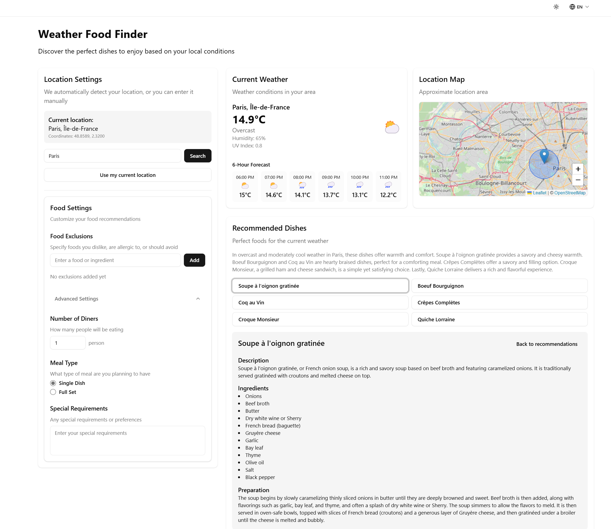

# Food Recommendation System

A web application that provides food recommendations based on weather conditions, location, and user preferences. Built with Next.js, TypeScript, Tailwind CSS, all AI models compatible with OpenAI library.

## Overview



This system analyzes current weather data and user preferences to suggest appropriate food choices. It integrates location services, interactive maps, and customizable settings to deliver personalized food recommendations.

## Features

- **Weather-Based Recommendations**: Tailored food suggestions based on current weather conditions
- **Location Services**: Current location detection or manual location entry
- **Interactive Map**: Visual representation of selected location
- **Food Exclusions**: Option to exclude specific foods from recommendations
- **Group Dining Support**: Configuration for number of diners and meal types
- **reCAPTCHA Protection**: Security enhancement for API endpoints
- **Internationalization**: Support for multiple languages using next-intl
- **Extended Settings**: Additional customization options

## Installation

### Prerequisites

- Node.js 18+ (20+ recommended)
- pnpm (recommended), npm, or yarn

### Standard Installation

1. Clone the repository
   ```bash
   git clone https://github.com/yourusername/food-recommendation-system.git
   cd food-recommendation-system
   ```

2. Install dependencies
   ```bash
   pnpm install
   ```

3. Set up environment variables
   ```bash
   cp .env.local.example .env.local
   # Edit .env.local with appropriate values
   ```

4. Start the development server
   ```bash
   pnpm dev
   ```

5. Access the application at [http://localhost:3000](http://localhost:3000)

### Docker Installation

For containerized deployment, Docker configuration is provided:

```bash
# Build and start the application
docker-compose up -d

# Access the application at http://localhost:3000
```

For more detailed Docker instructions, see [DOCKER.md](DOCKER.md).

## Environment Configuration

The application is configured through environment variables defined in the `.env` file. Key configuration categories include:

### API Keys

```
OPENAI_API_KEY=your_openai_api_key
```

### reCAPTCHA Configuration

```
NEXT_PUBLIC_RECAPTCHA_SITE_KEY=your_recaptcha_site_key
NEXT_PUBLIC_RECAPTCHA_ENABLED=true
RECAPTCHA_SECRET_KEY=your_recaptcha_secret_key
```

## Feature Management

The application uses feature flags to enable or disable specific functionality. These are configured through environment variables:

| Feature | Description | Environment Variable |
|---------|-------------|---------------------|
| Food Recommendations | Core recommendation functionality | `NEXT_PUBLIC_FEATURE_FOOD_RECOMMENDATIONS` |
| Food Details | Detailed food information | `NEXT_PUBLIC_FEATURE_FOOD_DETAILS` |
| Food Exclusions | Capability to exclude foods | `NEXT_PUBLIC_FEATURE_FOOD_EXCLUSIONS` |
| Extended Settings | Advanced configuration panel | `NEXT_PUBLIC_FEATURE_EXTENDED_SETTINGS` |
| Meal Type Selection | Meal type options | `NEXT_PUBLIC_FEATURE_MEAL_TYPE_SELECTION` |
| Number of Diners | Group dining options | `NEXT_PUBLIC_FEATURE_NUMBER_OF_DINERS` |
| Special Requirements | Dietary requirements input | `NEXT_PUBLIC_FEATURE_SPECIAL_REQUIREMENTS` |
| Weather Data | Weather integration | `NEXT_PUBLIC_FEATURE_WEATHER_DATA` |
| IP Geolocation | IP-based location detection (fallback method) | `NEXT_PUBLIC_FEATURE_IP_GEOLOCATION` |
| Manual Location | Manual location entry | `NEXT_PUBLIC_FEATURE_MANUAL_LOCATION` |
| Map Display | Interactive location map | `NEXT_PUBLIC_FEATURE_MAP_DISPLAY` |
| Cache system | Cache the result | `NEXT_PUBLIC_FEATURE_ENABLE_CACHING` |

Set any feature flag to `true` to enable it or `false` to disable it.

## Development Commands

- `pnpm dev` - Start development server
- `pnpm build` - Build for production
- `pnpm start` - Start production server
- `pnpm lint` - Run linting checks


## Acknowledgments

- OpenAI
- Weather data from Open-Meteo
- Map visualization using Leaflet, OpenStreetMap
- UI components from shadcn/ui 
